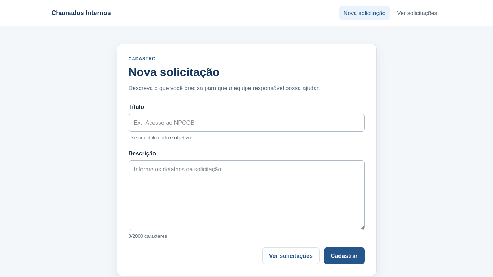
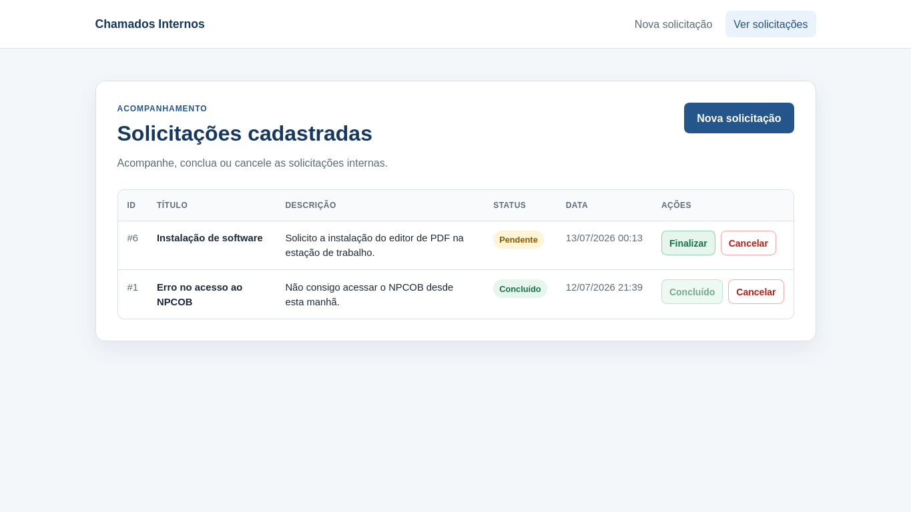

# Sistema de Controle de Chamados Internos

Projeto desenvolvido em PHP puro para cadastrar e acompanhar solicitações internas. Os dados ficam armazenados em PostgreSQL.

## Telas e requisitos

### Cadastro de solicitação

O formulário possui os campos título e descrição. Os dois são obrigatórios e são validados no navegador e novamente no servidor. Depois do cadastro, o sistema salva a solicitação com o status inicial `Pendente` e exibe uma mensagem de sucesso.



### Listagem de solicitações

A listagem exibe ID, título, descrição, status e data de cadastro. Uma solicitação pendente pode ser finalizada, alterando o status para `Concluido`. O botão cancelar pede confirmação antes de excluir o registro do banco.



## Tecnologias utilizadas

- PHP 8 com PDO
- PostgreSQL
- HTML, CSS e JavaScript
- Docker e Docker Compose

## Como executar

Usei Docker Compose para deixar o PHP com o driver `pdo_pgsql` e o PostgreSQL prontos para uso, sem depender da configuração da máquina. O Docker é opcional, mas é a forma mais rápida de testar o projeto.

Com Docker e Docker Compose instalados, execute:

```bash
docker compose up -d --build
```

Depois acesse [http://localhost:8088](http://localhost:8088). A tabela do banco é criada automaticamente na primeira execução.

Se a porta `8088` já estiver em uso, é possível escolher outra:

```bash
APP_PORT=8090 docker compose up -d
```

Para encerrar:

```bash
docker compose down
```

## Como testar

Além do teste manual pelas duas telas, existe um teste de integração que percorre o cadastro, a listagem, a conclusão e a exclusão:

```bash
docker compose exec app php tests/integracao.php
```

O teste roda dentro de uma transação e não deixa registros no banco.

## Execução sem Docker

Para executar diretamente na máquina, é necessário ter PHP 8 com `pdo_pgsql` e PostgreSQL instalados.

1. Crie o banco e execute o arquivo `database/schema.sql`.
2. Configure `DB_HOST`, `DB_PORT`, `DB_NAME`, `DB_USER` e `DB_PASSWORD`.
3. Inicie o servidor apontando para a pasta pública:

```bash
php -S localhost:8088 -t public
```
